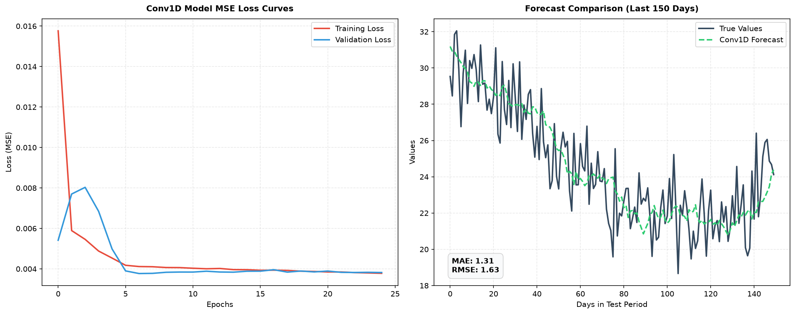

# Project 50: Sequence Prediction with Conv1D

This project implements a time-series forecasting pipeline using a **1D Convolutional Neural Network (Conv1D)** in TensorFlow 2. The model learns local temporal patterns from past sequence data to predict the next value in the series.

---

## Conceptual Overview

### 1. Convolution on Temporal Dimensions
In a standard 2D CNN, kernels slide across height and width dimensions (spatial features). In a **Conv1D** network, kernels slide along a single temporal axis. 

Given an input sequence window $X = [x_1, x_2, \dots, x_W]$ of size $W$ and a kernel filter $w$ of size $k$, the 1D convolution operation produces a feature map $C$ where each element is:

$$c_t = f\left(\sum_{j=1}^{k} w_j \cdot x_{t+j-1} + b\right)$$

Where:
- $f$ is the activation function (e.g., ReLU).
- $b$ is the bias.
- $k$ is the kernel size.

### 2. Advantages of Conv1D Over RNNs
- **Parallelization**: Convolutions can be computed in parallel across all time steps because there are no sequential hidden-state dependencies.
- **No Vanishing/Exploding Gradients**: Conv1D avoids the typical recurrent backpropagation-through-time (BPTT) issues of LSTMs/GRUs.
- **Memory Efficiency**: Conv1D requires fewer parameters to capture short-to-medium range dependencies.

---

## Model Architecture

Using Keras Sequential:
1. **Input Layer**: Shape `(30, 1)` representing past window steps.
2. **Conv1D Layer 1**: `Conv1D(filters=32, kernel_size=3, activation="relu")`
   - Extracts local sliding features of size 3.
3. **MaxPooling1D**: `MaxPooling1D(pool_size=2)`
   - Downsamples temporal feature maps, preserving maximum activations.
4. **Conv1D Layer 2**: `Conv1D(filters=64, kernel_size=3, activation="relu")`
   - Learns higher-level patterns.
5. **Flatten**: Flattens the feature map.
6. **Dense Layers**: Fully connected layers (`Dense(32, activation="relu")` $\rightarrow$ `Dense(1)`) to compute the final forecasting regression value.

---

## How to Run

Execute the main training and evaluation script:
```powershell
python main.py
```
This script will train the Conv1D model, evaluate it on unseen test data, report MAE and RMSE metrics, and output a visual dashboard `conv1d_forecasting_results.png`.

---

## Results

Upon execution, the script trains the Conv1D model and outputs the following dashboard:



